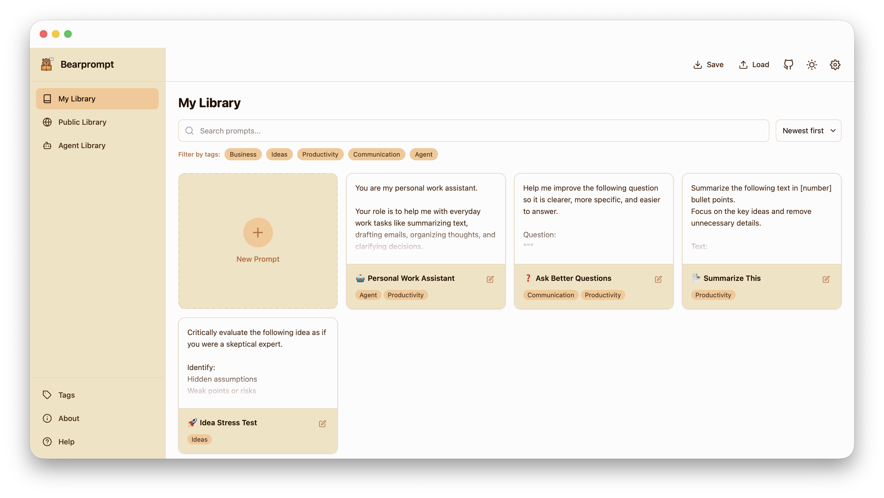

<p align="center">
  
</p>
<h1 align="center"> Bearprompt</h1> 

<p align="center">Your private prompt library for AI. Create and manage your prompt collection with ease.</p>

<p align="center" style="font-weight: bold;">Create your prompt library on <a href="https://bearprompt.com">bearprompt.com</a>.</p>

<p align="center">
  
</p>

## Features

- **Privacy-first**: Your prompts are stored locally in your browser. No data leaves your device.
- **Organize Prompts**: Build your personal collection of prompts for any AI tool or use case.
- **Search & Tags**: Find any prompt instantly with powerful search and flexible tagging.
- **Open-source**: Free forever. Inspect the code, contribute, or self-host.
- **Responsive Design**: Works seamlessly on desktop and mobile devices.

## Getting Started

### Prerequisites

- Node.js 18+ and npm

### Installation

```bash
# Clone the repository
git clone https://github.com/julianyaman/bearprompt.git
cd bearprompt

# Install dependencies
npm install
```

### Development

```bash
# Start development server
npm run dev

# Open http://localhost:5173 in your browser
```

### Build

```bash
# Build for production
npm run build

# Preview the production build
npm run preview
```

### Testing

```bash
# Run tests
npm test

# Run tests in watch mode
npm run test:watch
```

### Type Checking

```bash
npm run check
```

## Docker Deployment

Build and run with Docker:

```bash
# Build the image
docker build -t bearprompt .

# Run the container
docker run -p 3000:3000 bearprompt
```

The app will be available at `http://localhost:3000`.

## Contributing

Contributions are welcome! Please feel free to submit issues and pull requests.

1. Fork the repository
2. Create your feature branch (`git checkout -b feature/amazing-feature`)
3. Commit your changes (`git commit -m 'Add some amazing feature'`)
4. Push to the branch (`git push origin feature/amazing-feature`)
5. Open a Pull Request

## License

This project is licensed under the MIT License - see the [LICENSE](LICENSE) file for details.
