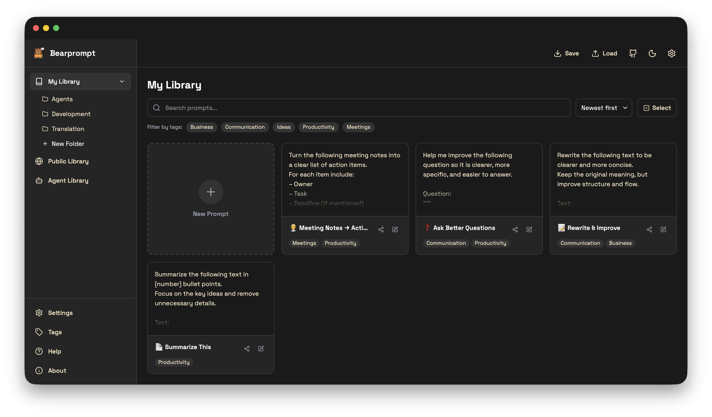

<p align="center">
  
</p>
<h1 align="center"> Bearprompt</h1> 

<p align="center">Your private prompt library, with curated public prompts and agent collections.</p>

<p align="center" style="font-weight: bold;">Create your prompt library on <a href="https://bearprompt.com">bearprompt.com</a>.</p>

<p align="center">
  
</p>

## Features

- **Private library**: Store your own prompts locally in the browser with no signup required.
- **Folders, search, and tags**: Organize prompts by folder, search quickly, and filter by tags.
- **Public prompt library**: Browse curated public prompts, featured categories, and highlighted authors.
- **Agent library**: Explore public agent collections and author pages.
- **Share prompts**: Share prompts with end-to-end encrypted links (just like Excalidraw).

## How It Works

Bearprompt has two main parts:

- **Your private library** lives in the browser and is stored locally using IndexedDB.
- **Public discovery features** such as prompts, agents, authors, and categories are served from Supabase.

This means the app is privacy-first for personal usage, while still supporting a public library experience.

## Getting Started

### Prerequisites

- Node.js 22+ and npm

### Installation

```bash
# Clone the repository
git clone https://github.com/julianyaman/bearprompt.git
cd bearprompt

# Install dependencies
npm install
```

### Development

```bash
# Start development server
npm run dev

# Open http://localhost:5173 in your browser
```

### Available Scripts

```bash
# Start the dev server
npm run dev

# Build for production
npm run build

# Preview the production build
npm run preview

# Type-check the project
npm run check

# Type-check in watch mode
npm run check:watch
```

### Environment Variables

Create a `.env` file based on `.env.example`:

```bash
cp .env.example .env
```

Current environment variables:

- `SUPABASE_URL`: Supabase project URL
- `SUPABASE_ANON_KEY`: client-side key for public reads and app usage
- `SUPABASE_SERVICE_ROLE_KEY`: server-side key for privileged operations
- `TURNSTILE_SECRET_KEY`: optional Cloudflare Turnstile secret for risk-based verification
- `PUBLIC_TURNSTILE_SITE_KEY`: optional public Turnstile site key

For purely local UI work, you can often develop without the optional Turnstile keys. Public library and publishing-related features depend on Supabase.

### Build

```bash
# Build for production
npm run build
```

## Docker Deployment

Build and run with Docker:

```bash
# Build the image
docker build -t bearprompt .

# Run the container
docker run -p 3000:3000 bearprompt
```

The container runs the SvelteKit Node build with `node build` and will be available at `http://localhost:3000`.

## Tech Stack

- **SvelteKit 2** with **Svelte 5**
- **Tailwind CSS 4**
- **Supabase** for public content and server-backed features
- **IndexedDB** for the local private library
- **@vercel/og** for Open Graph image generation

## Privacy Model

- **Private library data** is stored locally in the browser.
- **Public library content** is fetched from Supabase.
- **Shared links** are end-to-end encrypted and use Cloudflare Turnstile for abuse prevention.

If you self-host, review your Supabase and verification configuration carefully before exposing public flows.

## Contributing

Contributions are welcome! Please feel free to submit issues and pull requests.

1. Fork the repository
2. Create your feature branch (`git checkout -b feature/amazing-feature`)
3. Commit your changes using Conventional Commits, for example `feat(public): add category card hover state`
4. Push to the branch (`git push origin feature/amazing-feature`)
5. Open a Pull Request

Commit messages in this repo follow:

```text
<type>(<scope>): <description>
```

Examples:

- `feat(public): add featured category cards`
- `fix(library): sort prompts alphabetically`
- `docs(landing): update hero copy`

## License

This project is licensed under the MIT License - see the [LICENSE](LICENSE) file for details.
